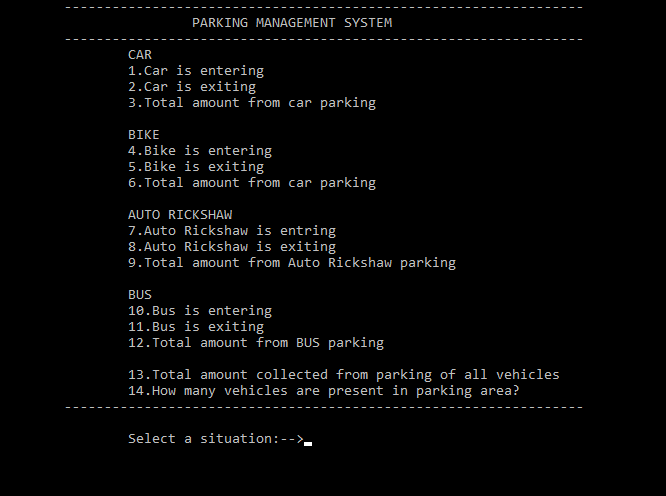

# ParkingManagementSystem
## Parking Management System using linked list data structure

**Some Explanations:**
1. Number written on number plate of a vehicle is followed by state and district code at the beginining for example: MH 04 35837 
2. Here MH is state code for any vehicle in Maharashtra. 04 indicates district code and 35387 is the vehicle number.
3. Program will store the number of vehicle as *DistrictcodeCarNumber ie. 0435837*

**Output:**

